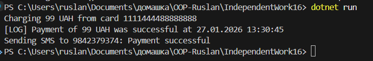
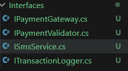
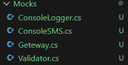
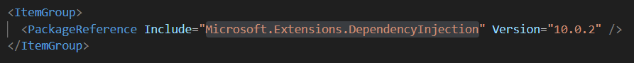
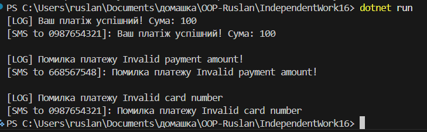
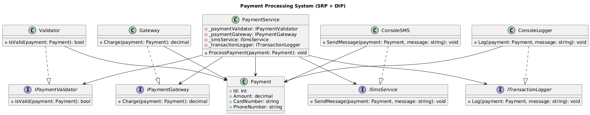

# Лабораторна робота №20

## Тема: Схема розподілу відповідальностей модуля.

### Завдання

- Реалізувати “поганий” клас OrderProcessor (порушує SRP).
- Виконати рефакторинг OrderProcessor для дотримання SRP.
- Продемонструвати роботу в методі Main.
- Створити діаграму класів (UML) для рефакторингової структури.

### Варіант

```
5. PaymentProcessor: Валідація платежу, списання коштів, логування транзакції, відправка
SMS.
- Рефакторинг: IPaymentValidator, IPaymentGateway, ITransactionLogger, ISmsService,
PaymentService.
```

### Виконання

### 1. Реалізувати початковий клас `PaymenrProcessor` (порушує SRP).

Для початку було створено модуль `Payment` (Приклад нижче). Після Створити початковий клас `PaymentProcessor` який приймає об'єкт класу `Payment`. Клас має порушувати принцип єдиної відповідальності та DIP.

Приклад коду:

```csharp
// Модель
public class Payment
{
    public int Id { get; set; }
    public decimal Amount { get; set; }
    public string CardNumber { get; set; } = string.Empty;
    public string PhoneNumber { get; set; } = string.Empty;

    public Payment(int id, decimal amount, string cardNumber, string phoneNumber)
    {
        Id = id;
        Amount = amount;
        CardNumber = cardNumber;
        PhoneNumber = phoneNumber;
    }
}

// Початковий клас із порушеннями
public class PaymentProcessor // Приклад порушення SPR.
{
    public void ProcessorPayment(Payment payment)
    {
        // Валідація
        if(payment.Amount <= 0)
            throw new Exception("Invalid payment amount!");

        if(string.IsNullOrWhiteSpace(payment.CardNumber))
            throw new Exception("Invalid card number");

        // Списання коштів
        Console.WriteLine($"Charging {payment.Amount} UAH from card {payment.CardNumber}");

        // Логування
        Console.WriteLine($"[LOG] Payment of {payment.Amount} UAH was successful at {DateTime.Now}");

        // Відправлення SMS
        Console.WriteLine($"Sending SMS to {payment.PhoneNumber}: Payment successful");
    }
}
```

В коді продемонстровано:

Метод `ProcessorPayment` Має зразок валідації.
Також він імітує логування, списання коштів та відпарвлення повідомлення SMS.

Клас повністю порушує головну ідею принципи SRP, тому що бере в одному класі ми маємо багато відповідальності, що протирічить принципам єдиної відповідальності.

Результат виводу цього пракладу коду в консоль.



### 2. Виконати рефакторинг PaymentProcessor для дотримання SRP.

Для того що б наша програма відповідала критеріям SRP та DIP вона повинна бути розділенна на кілька компонентів:

- Інтерфейси та їх реалізації;
- Заглушки `(mock implementations)` для інтерфeйсів;
- Новий `DI` клас `PaymentService`;

#### інтерфейси та їх реалізації:

було створено чотири інтерфейси, які відповідають тим, що були вказані в документації та моєму варіанті (В-5):



Приклад двох інтерфейсів:

```csharp
// Валідація
public interface IPaymentValidator
{
    bool IsValid(Payment payment);
}

// Логування
public interface ITransactionLogger
{
    void Log(Payment payment, string message);
}
```

Їх реалізації показані в розділі "Заглушки `(mock implementations)` для інтерфeйсів"

#### Заглушки `(mock implementations)` для інтерфeйсів:

Кожен із інтерфейсів було реалізовано в Mocks



Код приклад заглушок:

```csharp
// Логування
public class ConsoleLogger : ITransactionLogger
{
    public void Log(Payment payment, string message)
    {
        Console.WriteLine($"[LOG] {message}");
    }
}

// Валідатор
public class Validator : IPaymentValidator
{
    public bool IsValid(Payment payment)
    {
        if(payment.Amount <= 0)
        {
            throw new Exception("Invalid payment amount!");
        }

        if (string.IsNullOrWhiteSpace(payment.CardNumber))
        {
            throw new Exception("Invalid card number");
        }

        if(string.IsNullOrWhiteSpace(payment.PhoneNumber))
        {
            throw new Exception("Invalid phone number");
        }

        return true;
    }
}
```

#### Новий `DI` клас `PaymentService`;

Клас збирає використовує заглушки, та використовує через свій конструктор `Dependency Injection` який було інстальвано в `dotnet package`:



Нижче скріншот коду сервісу:

```csharp
public class PaymentService
{
    private readonly IPaymentGateway _paymentGateway;
    private readonly IPaymentValidator _paymentValidator;
    private readonly ISmsService _smsService;
    private readonly ITransactionLogger _transactionLogger;

    public PaymentService(
        IPaymentGateway paymentGateway,
        IPaymentValidator paymentValidator,
        ISmsService smsService,
        ITransactionLogger transactionLogger
    )
    {
        _paymentGateway = paymentGateway;
        _paymentValidator = paymentValidator;
        _smsService = smsService;
        _transactionLogger = transactionLogger;
    }

    public void ProccesorPayment(Payment payment)
    {
        try
        {
            // Визває валідатор
            _paymentValidator.IsValid(payment);

            // Списання коштів
            decimal chargeAmount = _paymentGateway.Charge(payment);

            // Логування
            string message = $"Ваш платіж успішний! Сума: {chargeAmount}";

            _transactionLogger.Log(payment, message);

            // Відправка SMS
            _smsService.SendMessage(payment, message);
        }
        catch(Exception ex)
        {
            string errorMessage = $"Помилка платежу {ex.Message}";
            _transactionLogger.Log(payment, errorMessage);
            _smsService.SendMessage(payment, errorMessage);
        }
    }
}
```

Але сам `DI` був зібраний в окремому фалі `Program.cs`, де через `IServiceCollection` був зібраний контейнер, через який можна встановлювати час життя окремих кусків програми.

```csharp
IServiceCollection services = new ServiceCollection(); // контейнер

services.AddScoped<PaymentService>();

services.AddScoped<IPaymentGateway, Geteway>();
services.AddScoped<IPaymentValidator, Validator>();

services.AddTransient<ISmsService, ConsoleSMS>();
services.AddSingleton<ITransactionLogger, ConsoleLogger>();

var serviceProvider = services.BuildServiceProvider();
```

### 3. Продемонструвати роботу в методі Main.

Як уже зрозуміло демострація не через метод `Main()` а через `DI` в `Program.cs`.

```csharp
var payment_1 = new Payment(id: 1, amount: 100, cardNumber: "0123456789", phoneNumber: "0987654321");
var payment_2 = new Payment(id: 2, amount: 0, cardNumber: "645647578", phoneNumber: "668567548");
var payment_3 = new Payment(id: 3, amount: 299, cardNumber: "", phoneNumber: "0987654321");


var paymentServiceProvider = serviceProvider.GetRequiredService<PaymentService>();

paymentServiceProvider.ProccesorPayment(payment_1);
Console.WriteLine();
paymentServiceProvider.ProccesorPayment(payment_2);
Console.WriteLine();
paymentServiceProvider.ProccesorPayment(payment_3);
```

### Результати (вивід у консоль):



### Створити діаграму класів (UML) для рефакторингової структури.


