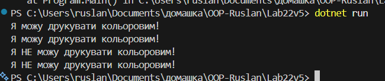

# Лабораторна робота №22

## Тема: LSP: виявлення порушень і альтернативи.

## Завдання

- Реалізувати початкову ієрархію класів, яка порушує LSP.
- Проаналізувати порушення LSP.
- Запропонувати та реалізувати альтернативне рішення, що дотримується LSP.
- Продемонструвати коректну роботу альтернативного рішення в Main.

## Варіант v5

Принтери (Printer & BlackAndWhitePrinter):

- Базовий клас: Printer з методом PrintColorImage().
- Похідний клас: BlackAndWhitePrinter.
- Проблема: Чорно-білий принтер не може надрукувати кольорове зображення, порушуючи очікувану поведінку базового класу.

## Виконання

### Реалізувати початкову ієрархію класів, яка порушує LSP.

Перед тим як реалізувати початковий клас який порушує LSP, потрібно зроміти що таке LSP. LSP - це принцип який говорить нам, що об'єкти підкласу можуть бути замінені на обєкти базового класу без порушення роботи програми.

Ось приклад коду поганого варіанту:

```csharp
public class Printer
{
    public virtual void PrintColorImage() => Console.WriteLine("Кольорове зображення надруковано!");
}

public class BlackAndWhitePrinter : Printer
{
    // Кидаю Exception тому що чорнобілий принтер не можу роздрукувати кольоворе зображення.
    public override void PrintColorImage() => throw new NotImplementedException();
}

class Program
{
    static void MakePrinterPrint(Printer print)
    {
        print.PrintColorImage();
    }

    static void Main()
    {
        // Буде викинуто NotImplementedException()
        Printer printer = new BlackAndWhitePrinter();
        MakePrinterPrint(printer);
    }
}
```

### Проаналізувати порушення LSP.

У цьому варіанті принцип порушено, тому що підклас `BlackAndWhitePrinter` не виконує контракт базового класу `Printer`. Метод `PrintColorImage()` базового класу обіцяє, що принтер може друкувати кольоровим.

### Запропонувати та реалізувати альтернативне рішення, що дотримується LSP.

Альтернативне рішення: можна зробити окремий інтерфейс `IColorPrintBehavior` який має метод `ColorPrint()`, його реалізують два класи: `CanColorPrint` та `CannotColorPrint`.

```csharp
public interface IColorPrintBehavior
{
    void ColorPrint();
}

public class CanColorPrint : IColorPrintBehavior
{
    public void ColorPrint() => Console.WriteLine("Я можу друкувати кольоровим!");
}

public class CannotColorPrint : IColorPrintBehavior
{
    public void ColorPrint() => Console.WriteLine("Я НЕ можу друкувати кольоровим!");
}
```

Також створено абстрактний базовий клас `Printer`, в ньому була реалізована композиція із інтерефейсом `IColorPrintBehavior`. Поле colorPrint зберігає посилання на об'кт який реалізує інтерфейс.

```csharp
public abstract class Printer
{
    protected IColorPrintBehavior colorPrint;

    protected Printer(IColorPrintBehavior colorPrint)
    {
        this.colorPrint = colorPrint;
    }

    public void PerformColorPrint()
    {
        colorPrint.ColorPrint();
    }
}
```

Від цього класу наслідуються два класи `ColorPrinter` та `BlackAndWhitePrinter`, які передають конкретну реалізацію в базовий клас через конструктор.

```csharp
// Наслідуваня від абстрактного базового класу.
public class ColorPrinter : Printer
{
    public ColorPrinter() : base(new CanColorPrint()) {}
}

public class BlackAndWhitePrinter : Printer
{
    public BlackAndWhitePrinter() : base(new CannotColorPrint()) {}
}
```

### Продемонструвати коректну роботу альтернативного рішення в Main.

В Main було створено об'єкти базового та підкласу, для демонстрації роботи та працездатності обох варіантів. Створено об'єкти `ColorPrint` та `BlackAndWhitePrinter`, і ці два варіанта працюють коректно.

```csharp
class Program
{
    static void Main()
    {
        // Обєкт створюється через Printer
        Printer colorPrinter = new ColorPrinter();
        colorPrinter.PerformColorPrint();

        // Підміна на об'єкт підкласу
        ColorPrinter colorPrinter1 = new ColorPrinter();
        colorPrinter1.PerformColorPrint();

        Printer blackAndWhitePrinter = new BlackAndWhitePrinter();
        blackAndWhitePrinter.PerformColorPrint();

        BlackAndWhitePrinter blackAndWhitePrinter1 = new BlackAndWhitePrinter();
        blackAndWhitePrinter1.PerformColorPrint();
    }
}
```

Результат виводу в консоль:


