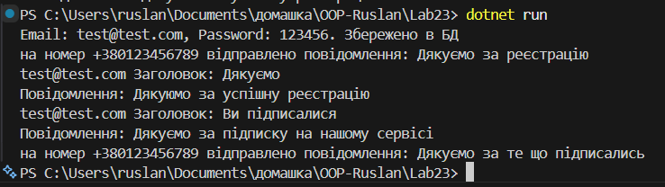

# Лабораторна робота №23

## Тема: ISP & DIP: рефакторинг і DI через конструктор.

## Завдання

- Реалізувати початкову структуру (порушує ISP та DIP)
- Проаналізувати порушення.
- Виконати рефакторинг.
- Продемонструвати роботу.

## Варіант v5

User Authentication & Notification (UserAccountManager):

- Клас: UserAccountManager для реєстрації, входу, відправки email та SMS.
- Залежності: DatabaseConnection, SmtpClient, SmsGateway.
- Проблема: Змішування логіки та прямі залежності від служб відправки повідомлень.

## Виконання

### Реалізувати початкову структуру (порушує ISP та DIP)

Початкова структара яка порушує ISP та DIP принципи виглядає приблизно ось так:

```csharp
// Поганий варіант використання SIP та DIP

public interface IUserAccountMenager
{
   void Register(string email, string password);
   void SendEmail(string email, string subject, string body);
   void SendSms(string number, string message);
}

public class UserAccountMenager : IUserAccountMenager
{
    private DataBaseConnections _db = new DataBaseConnections();
    private SmtpClient  _smpt = new SmtpClient();
    private SmsGateway _sms = new SmsGateway();

    public void Register(string email, string password)
    {
        _db.SaveUser(email, password);
        _smpt.SendEmail(email, "Дякуємо за реєстрацію", "Дуже дякуємо за реєстрацію на нашому сервісі");
    }

    public void SendEmail(string email, string subject, string body)
    {
        _smpt.SendEmail(email, subject, body);
    }

    public void SendSms(string number, string message)
    {
        _sms.SendSms(number, message);
    }
}
```

### Проаналізувати порушення

Основні порушення:

- Інтерфейс має абстракції відразу трьох не св'язаних між собою методів. Порушення ISP
- Пряме створення `DataBaseConnections`, `SmtpClient`, `SmsGateway` це порушує DIP

ось приклади в коді:

```csharp
// Перенасичений інтерфейс
// Якщо нам потрібна тільки реєстрація нам все одно прийдеться писати відправку повідомлень
public interface IUserAccountMenager
{
   void Register(string email, string password);
   void SendEmail(string email, string subject, string body);
   void SendSms(string number, string message);
}

// UserAccountMenager Прямо створює ці класи.
    private DataBaseConnections _db = new DataBaseConnections();
    private SmtpClient  _smpt = new SmtpClient();
    private SmsGateway _sms = new SmsGateway();
```

### Виконати рефакторинг

Для початку було розбито інтерфейс на декілька менших `IDataBaseConnections`, `ISmtpClient` та `ISmsGateway`

Приклад інтерфейсу:

```csharp
public interface IDataBaseConnections
{
    void Register(string email, string password);
}
```

І для кожного було створено заглушки, які імітують наші вимоги:

```csharp
// Проста імітація збереження в бд
public class DbConnections : IDataBaseConnections
{
    public void Register(string email, string password)
    {
        Console.WriteLine($"Email: {email}, Password: {password}. Збережено в БД");
    }
}
```

Також змінено впровадження ін'єкції, поля із класами тепер композиція, а потім череез конструктор у нас ін'єкція.
Приклад коду в класі `UserAccountMenager`:

```csharp
// Поля
    private readonly IDataBaseConnections _dbConnect;
    private readonly ISmsGateway _sms;
    private readonly ISmtpClient _smtp;

    // Впровадження ін'єкцій через конструктор
    public UserAccountMenager(
        IDataBaseConnections dbConnect,
        ISmsGateway sms,
        ISmtpClient smtp
    )
    {
        _dbConnect = dbConnect;
        _sms = sms;
        _smtp = smtp;
    }
```

У файлі `Program.cs` у реалізований DI через бібліотеку `DependencyInjection`

Приклад коду:

```csharp
// За допомгою бібліотки DI можна контейнеризувати DI

IServiceCollection services = new ServiceCollection(); // Контейнер DI

// Житєвий цикл програми
services.AddSingleton<IDataBaseConnections, DbConnections>(); // Якщо просять IDataBaseConnections то використовуємо DbConnections
services.AddSingleton<ISmsGateway, SmsSend>();
services.AddSingleton<ISmtpClient, EmailSendSms>();

services.AddTransient<UserAccountMenager>();
```

### Продемонструвати роботу

Результат виводу програми в консоль


