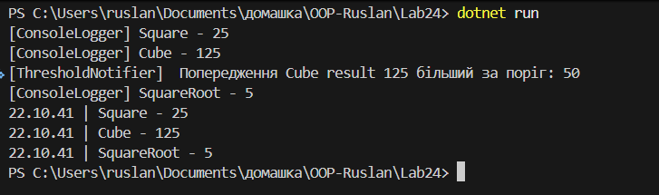

# Лабораторна робота №24

## Тема: Strategy + Observer: динамічна підстановка алгоритмів.

## Завдання

- Реалізувати систему обробки числових даних, використовуючи Strategy та Observer.
  - Патерн strategy.
    - інтерфейс
    - Кілька його реалізацій
    - Клас NumericProcessor, який міняє стратегії
  - Патерн Observer
    - Клас ResultPublisher
    - Кілька класів спостерігачів
- Продемонструвати роботу в Main

## Виконання

### Інтерфейс для класу Strategy

Створено інтерфейс `INumericOperationStrategy`, в якому є поля `string Name { get; }` - для передавання імені операції для класу спостерігачу в в патерні `Ovserver`, та є метод `double Execute(double value);` укий повертає число.

```csharp
public interface INumericOperationStrategy
{
    // Добавлено поле Name для виводу назви операції в патерні Observer
    string Name { get; }
    double Execute(double value);
}
```

### Реалізації інтерфейсу

Реалізації інтерфесу це різні обчислення числа. Всього три класи для обислення: Обчислення квадрату числа, обчислення кубу чилса, обчислення квадратного кореню числа.

Приклад одного із класів реалізації:

```csharp
public class CubeOperationStrategy : INumericOperationStrategy
{
    public string Name => "Cube";
    public double Execute(double value) => value * value * value;
}
```

### Клас NumericProcessor

В класі є DI через конструктор. Це залежність від `INumericOperationStrategy`, через який можна використовувати усі його реалізації.

Є метод `SetStrategy()` черезе який можна бміняти стратегію в на ходу. Також є метод `Process()` який викликає клас для обчислення числа, та передає це число класу.

```csharp
public sealed class NumericProcessor
{
    private INumericOperationStrategy _strategy;

    public NumericProcessor(
        INumericOperationStrategy strategy,
    )
    {
        _strategy = strategy;
    }

    public void SetStrategy(INumericOperationStrategy strategy) // Завдяки цьому можна міняти стратегії
    {
        _strategy = strategy;
    }

    public double Process(double input)
    {
        return _strategy.Execute(input);
    }
}
```

### Патерн Observer

Патерн має клас `ResultPublisher` який має івент `ResultCalculated`, також є метод `PublishResult(double result, string operationName)`, через нього будуть виведені результати, через об'єкти класів які підписані на івен.

```csharp
public sealed class ResultPublisher
{
    // Івент на який можуть підписатись
    public event Action<double, string>? ResultCalculated;

    public void PublishResult(double result, string operationName)
    {
        ResultCalculated?.Invoke(result, operationName);
    }
}
```

### Класи спостерігачі

У класів спостерігачів є метод `Subscribe` та `Unuscribe`, через який можна підписатись та відписатись від івенту. Окрім цих двох методів в кожного класа окрема задача. Є клас `ConsoleLoggerObserver`, `HistoryLoggerObserver` та `ThresholdNotifierObserver`. Перший для логування, другий для зберігання логування в списку, а третій для позначення порогу результата числа.

Приклад одного із класів:

```csharp
public sealed class HistoryLoggerObserver
{
    // Тут сберігаються логи
    private readonly List<string> _history = new();

    public IReadOnlyList<string> History => _history;

    public void Subscribe(ResultPublisher publisher)
        => publisher.ResultCalculated += OnResultCalculated;

    public void Unuscribe(ResultPublisher publisher)
        => publisher.ResultCalculated -= OnResultCalculated;

    private void OnResultCalculated(double result, string operationName)
    {
        _history.Add($"{DateTime.Now:HH.mm.ss} | {operationName} - {result}");
    }
}
```

### Зміна в класі NumericProcessor

В класі `NumericProcessor` для були внесені зміни для взаємодії із патерном Observer. Було додано залежність через конструктор, а саме клас `ResultPublisher`, через який у методі `Process` викликається метод `PublishResult`, який у свою чергу викликає всі методи `OnResultCalculated` класів які підписані на івент.

Клас після змін:

```csharp
// Об'єднання Strategy та Observer
public sealed class NumericProcessor
{
    private INumericOperationStrategy _strategy;
    private readonly ResultPublisher _publisher;

    public NumericProcessor(
        INumericOperationStrategy strategy,
        ResultPublisher publisher
    )
    {
        _strategy = strategy;
        _publisher = publisher;
    }

    public void SetStrategy(INumericOperationStrategy strategy) // Завдяки цьому можна міняти стратегії
    {
        _strategy = strategy;
    }

    public double Process(double input)
    {
        double result = _strategy.Execute(input);

        _publisher.PublishResult(result, _strategy.Name);

        return result;
    }
}
```

### Результат в Main

В статичному методі Main створено об'єкт класу `ResultPublisher`, а також усіх класів спостерігачів. Потім підписано всіх класів спостерігачів на івент. Також створено об'єкт класу `NumericProcessor`, якому відразу передано стратегію ти число. Потім через об'єкт визвано метод Procces. Також можна викликати метод `SetStrategy()` для зміни стратегії.
В кінці в методі Main було створено цикл для виводу всіх логуваннь із списку логів.

```csharp
static void Main()
    {
        var publisher = new ResultPublisher();

        // Спостерігачі
        var ConsoleLogger = new ConsoleLoggerObserver();
        var historyLogger = new HistoryLoggerObserver();
        var thresgoldNotifier = new ThresholdNotifierObserver(threshold: 50);

        // Підписка
        ConsoleLogger.Subscribe(publisher);
        historyLogger.Subscribe(publisher);
        thresgoldNotifier.Subscribe(publisher);

        // Процесор із патерну Strategy
        var processor = new NumericProcessor(new SquareOperationStrategy(), publisher);

        // При визові Process будуть використані спостерігачі які підписані на івенти
        processor.Process(5);
        // Можна використати SetStrategy для зміни стратегії
        processor.SetStrategy(new CubeOperationStrategy());
        processor.Process(5);
        processor.SetStrategy(new SquareRootOperationStrategy());
        processor.Process(25);

        // Перегляд історії логування
        foreach(var item in historyLogger.History)
        {
            Console.WriteLine(item);
        }
    }
```

## Результат

Результат програми виведений в консоль:


Тут видно результати логів, та попередження про перевищеня порогу.
