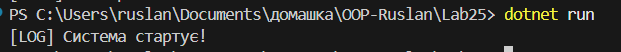
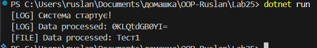

# Лабораторна робота №25

## Тема: Інтеграція патернів

## Завдання

- Реалізувати інтегровану систему, що використовує патерни Factory Method, Singleton, Strategy та Observer.
- Реалізувати сценарії демонстрації в методі Main
- Продемонструвати роботу

## Виконання

В проєкті було створено 3 папки, для зручності. У папці `Logger` фабричний патерн логування, у нього є 2 конкретних творця, і два конкретних продукти. Також в цій самій директорії у нас є `LoggerMenager` який є глобальним доступом до логування, це патерн `Singleton`. Є папки `DataProcessor` в середині реалізовано патерн стартегія. І остання директорія, це Observer, яка говорить сама за себе, що в середині патерн `observer`/

### Factory

Є інтерфейс `ILogger` - це абстрактний продукт, у нього є метод `Log(string message)`, його реалізовують конкретні продукти `ConsoleLogger` та `FileLogger`. Для вибору творця було створено абстрактний клас `LoggerFactory` із абстрактним методом `ILogger CreateLogger()`, якого реалізовують конкретні творці `ConsoleLoggerFactory` та `FileLoggerFactory`.

```csharp
// Продукт
public interface ILogger
{
    void Log(string message);
}

// Приклад одного із конкретних продуктів
public class ConsoleLogger : ILogger
{
    public void Log(string message) => Console.WriteLine($"[LOG] {message}");
}

// Творець
public abstract class LoggerFactory
{
    public abstract ILogger CreateLogger();
}

// Приклад одного із конкретного творців
public class ConsoleLoggerFactory : LoggerFactory
{
    public override ILogger CreateLogger()
    {
        return new ConsoleLogger();
    }
}
```

### Singleton

В папці `Logger/SingletonLogger` є клас `LoggerMenager` це Singleton патерн, який створюється один раз за весь час життя програми. Через цей клас можна керувати фабрикою, так як в класі є метод `Initialize` який має параметр `LoggerFactory`.

Клас:

```csharp
using System.Net;

public sealed class LoggerMenager
{
    private static readonly object _lock = new object();
    private static LoggerMenager? _instance;

    private ILogger _logger;

    private LoggerMenager(ILogger logger)
    {
        _logger = logger;
    }

    public static void Initialize(LoggerFactory factory)
    {
        lock (_lock)
        {
            if(_instance == null)
            {
                _instance = new LoggerMenager(factory.CreateLogger());
            }
            else
            {
                _instance._logger = factory.CreateLogger();
            }
        }
    }

    public static LoggerMenager Instance
    {
        get
        {
            if(_instance == null)
            {
                throw new InvalidOperationException("Логер менеджер не інізіалізований");
            }
            return _instance;
        }
    }

    public void Log(string message)
    {
        _logger.Log(message);
    }
}
```

### Strategy

Було створено інтерфейс `IDataProcessorStrategy`, який містить в собі метод `string Process(string message)`, його реалізують два класи, ось приклад одного із них:

```csharp
public class CompressDataStrategy : IDataProcessorStrategy
{
    // Для прикладу просто прибираємо пробілии
    public string Process(string data)
    {
        return data.Replace(" ", "");
    }
}
```

Є клас стратегія `DataContext`, у нього є дві залежності, перша `IDataProcessorStrategy`, друга `DataPublisher` для взаємодії із патерном `Observer`. Головна ідея цього класу це метод `SetStrategy(IDataProcessorStrategy strategy)`, завдяки якому можна міняти стратегію динамічно.

код класу:

```csharp
public sealed class DataContext
{
    private IDataProcessorStrategy _strategy;
    private readonly DataPublisher _publisher;

    public DataContext(
        IDataProcessorStrategy strategy,
        DataPublisher publisher
        )
    {
        _strategy = strategy;
        _publisher = publisher;
    }

    public void SetStrategy(IDataProcessorStrategy strategy)
    {
        _strategy = strategy;
    }

    public string Process(string input)
    {
        var result =  _strategy.Process(input);

        _publisher.Publish(result); // тут викликаються класи які підписанні на івент
        return result;
    }
}
```

### Observer

Існує клас `DataPublisher` який має івент `DataProcessed`, у класу також є метод `Publish` якого можна викликати якщо об'єкт класу `ProcessingLoggerObserver` буде підписаний на івент. Також в класі `ProcessingLoggerObserver`є приватний метож `OnDataProcessed(string processedData)` який використовує для логування через `LoggerMenager`

Код класу:

```csharp
// DataPublisher
public sealed class DataPublisher
{
    public event Action<string>? DataProcessed;

    public void Publish(string processedData)
    {
        DataProcessed?.Invoke(processedData);
    }
}


// ProcessingLoggerObserver
public class ProcessingLoggerObserver
{
    public void Subscribe(DataPublisher publisher)
    {
        publisher.DataProcessed += OnDataProcessed;
    }

    public void Unsubscribe(DataPublisher publisher)
    {
        publisher.DataProcessed -= OnDataProcessed;
    }

    private void OnDataProcessed(string processedData)
    {
        LoggerMenager.Instance.Log(
            $"Data processed: {processedData}"
        );
    }
}
```

### Демонстрація сценаріїв

Ініціалізовано `LoggerMenager` із `ConsoleLoggerFactory`. Створено об'єкт класу `DataPublisher`. Такоє створено об'єкт класу `DataContext` в який передано стартегію `EncryptDataStrategy` та об'єкт класу `DataPublisher`. Створено об'єкт класу `ProcessingLoggerObserver` який відразу підписано на об'єкт `DataPublisher`. Після цього викликаємо метод `Procces` в який передано своло `тест`

```csharp
        LoggerMenager.Initialize(new ConsoleLoggerFactory());
        LoggerMenager.Instance.Log("Система стартує!");


        var publisher = new DataPublisher();

        var dataContext = new DataContext(new EncryptDataStrategy(), publisher);


        var loggerObserver = new ProcessingLoggerObserver();

        // Підписуємо його на івент
        loggerObserver.Subscribe(publisher);
```

Після цього програма виводить:



Тепер міняємо динамічно стратегію та фабрику:

```csharp
static void Main()
    {
        // Ініціалізація LoggerMenager
        LoggerMenager.Initialize(new ConsoleLoggerFactory());
        LoggerMenager.Instance.Log("Система стартує!");


        var publisher = new DataPublisher();

        var dataContext = new DataContext(new EncryptDataStrategy(), publisher);


        var loggerObserver = new ProcessingLoggerObserver();

        // Підписуємо його на івент
        loggerObserver.Subscribe(publisher);


        // Визаваємо метод який передає параметер конкретному творцю, який у свою чергу створює EncryptDataStrategy()
        dataContext.Process("Тест");


        // Динамічна зміна фабрики
        LoggerMenager.Initialize(new FileLoggerFactory());

        // Динамічна зміна стратегії
        dataContext.SetStrategy(new CompressDataStrategy());

        dataContext.Process("Тест 1");
    }
```

Результат в консолі:


