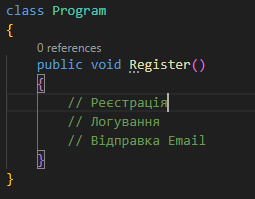
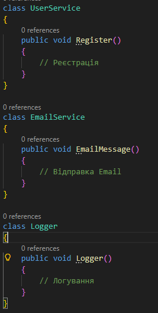

# Домашня робота

### Опишіть характеристики "God Object" анти-патерну.

- Має дуже багато методів
- тримає багато різних залежностей
- напряму працює із:
    - БД
    - бізнес логікою
    - логами
    - HTTP

### Наведіть приклад простого класу, який порушує SRP, і поясніть, чому.

Ось приклад класу який порушує SRP:

- 

    - це поганий приклад, тому що клас бере на себе більш ніж одну відповідальність.

### Запропонуйте, як можна рефакторити цей клас для дотримання SRP.

Ось приклад рефакторингу:
- Розбити цей клас на 3 меньших, які будуть виконувати по одній задачі, а тобто буде дотримуватись принципу однієї відповідальності. Нижче видно скріншот.

- 
