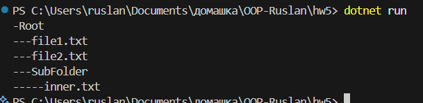

# Домашня робота №5

## Тема - Composite: дерево як єдина колекція

## Завдання

- Пояснити як патерн `Composite` дозволяє працювати із ієрархічними структурами.
- навести 2-3 приклади рельних сценаріїв.
- Переваги та недоліки патерну `Composite`.

### Як патерн `composite` дозваоляє працювати із ієрархічними структурами?

Патерн дозволяє працювати із ієрархією так, ніби це дерево один об'єкт. Композиція може містити в собі такі ж самі об'єкти як і вона сама. Завдяки цьому весь виклик відбувається без перевірки типів.

### Де використовується патерн

Патерн використовується де потрібна ієрархія, наприклад файлова система.
Я підготував приклад, у файлі `Composite.cs` я написав готовий приклад, симуляції файлової системи.

ось приклад виводу результату в консоль:

Але окрім цього ось ще два приклади де можна використовувати цей патерн:

- UI кнопка, панель, форма - це все компоненти.
- Організаційна структура компанії, тобто компанії головний CEO, його гілки це Meneger а у менеджера це програміст.
- Мій Minecraft server list, є Server і є категорії PvP, Survival у категорій може бути режим хард, ваніла.

### Мінуси та плюси використання патерну

- Плуси
  - Одинковий інтерфейс для об'єктів і груп
  - Зручно працювати із деревоподібними структурами
  - Легко додавати нові елементи, дотримання принципи OCP
- Мінуси
  - Можливе порушення SRP, так як Копозиція робитись забагато
  - Структура може стати занадто великою та складаною
  - Може додавати зайву абстракція там де вона не потрібна
