# Лабораторна робота №20

## Тема: SRP: декомпозиція OrderProcessor.

### Завдання

- Реалізувати початковий клас OrderProcessor (порушує SRP).
- Виконати рефакторинг OrderProcessor для дотримання SRP.
- Продемонструвати роботу в методі Main.

### Виконання 

### 1. Реалізувати початковий клас OrderProcessor (порушує SRP).
Для початку варто створити клас `Order` (Зразок із документації). Після Створити початковий клас `OrderProcessor` який приймає об'єкт класу `Order`. Клас має порушувати принцип єдиної відповідальності. Знизу скрнішот класу:

- 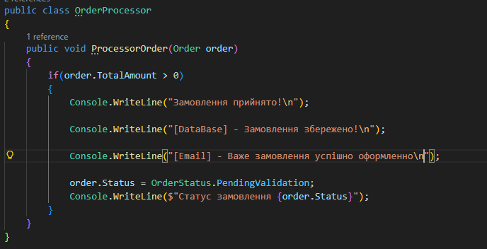

В скріншоті продемонстровано:

Метод `ProcessorOrder` імітує валідацію, момент коли виводиться 'Замовлення прийнято!'.
Також він імітує логування Бази даних, та повідомлення від Email. В кінці метод оновлює статус.

Чому цей клас порушує принцим SRP? А саме тому, що він на себе багато відповідальності.

Результат виводу цього пракладу коду в консоль.

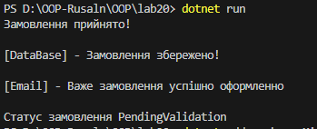

### 2. Виконати рефакторинг OrderProcessor для дотримання SRP.

Для того що б наша програма відповідала критеріям SRP вона повинна бути розділенна на кілька компонентів:

- Інтерфейси та їх реалізації;
- Заглушки `(mock implementations)` для інтерфeйсів;
- Новий `DI` клас `OrderService`;

#### інтерфейси та їх реалізації:

було створено три інтерфейси, які відповідають тим, що були вказані в документації:

- 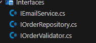

Приклад одного із них:

- 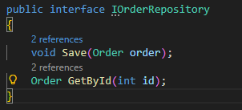

Їх реалізації показані в розділі "Заглушки `(mock implementations)` для інтерфeйсів"

#### Заглушки `(mock implementations)` для інтерфeйсів:

Відмінно від прикладу із документації було створено заглушку `Validator`, і інші дві `ConsoleEmailService` та `InMemoryRepository`:

- 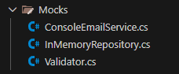

Скріншоти заглушок:

- 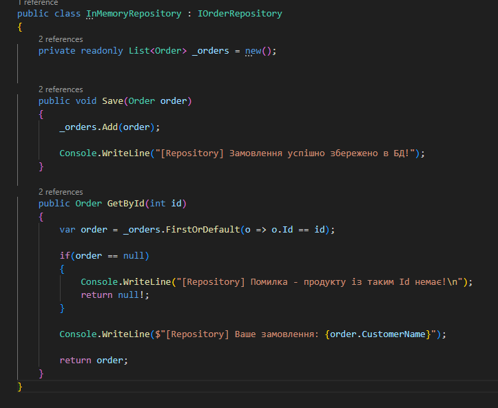 `InMemoryRepository`

- 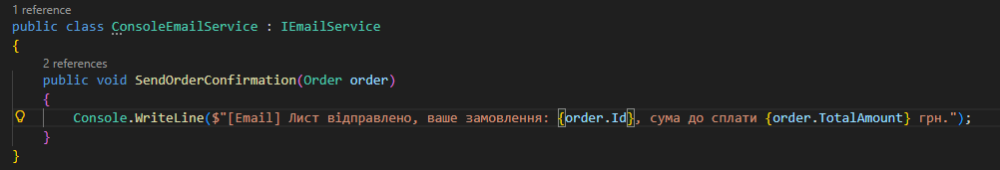 `ConsoleEmailService`

- 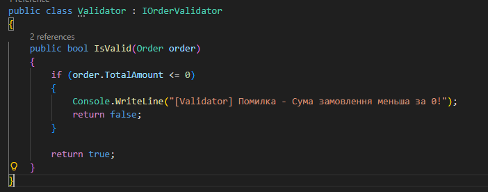 `Validator` 

#### Новий `DI` клас `OrderService`;

Клас збирає використовує заглушки, та використовує через свій конструктор `Dependency Injection` який було інстальвано в `dotnet package`:

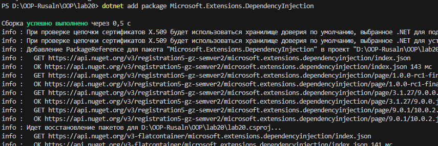

Нижче скріншот класу 

- 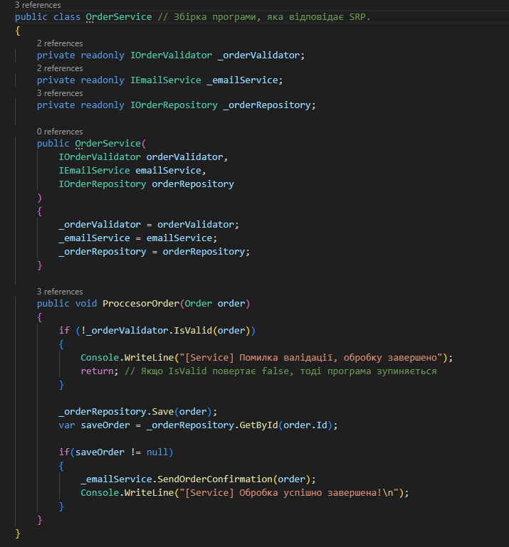

Але сам `DI` був зібраний в окремому фалі `Program.cs`, де через `IServiceCollection` був зібраний контейнер, через який можна встановлювати час життя окремих кусків програми.

- 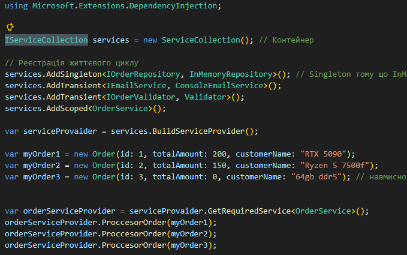

### 3. Продемонструвати роботу в методі Main.

Як уже зрозуміло демострація не через метод `Main()` а через `DI` в `Program.cs`.

- 

### Результати (вивід у консоль):

- 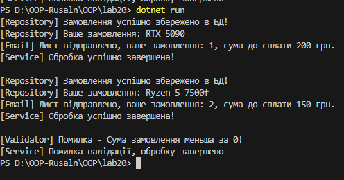