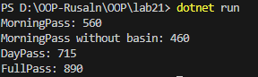

# Лабораторна робота №21
Варіант - 5

## Тема 
OCP: гнучкі алгоритми розрахунку (Factory/Strategy).

## Завдання

#### Реалізувати систему розрахунку вартості доставки (Shipping) з дотриманням OCP:

- Інтерфейс `IShippingStrategy`.
- Кілька реалізацій.
- `ShippingStrategyFactory` (Фабричний метод).
- Клас `DeliveryService`.


#### Продемонструвати роботу в методі Main
Створити новий клас NightShippingStrategy (нічна доставка), який додає фіксовану

(В моєму варіанті класи та інтерфейси мають інші назви)

## Мій варіант

Абонемент у спортзал:
- Стратегії: MorningPass, DayPass, FullPass.
- Параметри: Кількість годин, Додаткові послуги (сауна/басейн).
- Логіка: Різні коефіцієнти на час доби.

## Виконання

#### Інтерфейс:
Створено інтерфейс `IGymStrategy` який має в собі ось таку абстракцію:
```csharp
public interface IGymStrategy
{
    decimal CalculateCost(decimal hours, bool basin);
}
```

#### Реалізації:
Було створено 3 класи які реалізують інтерфейс `DayPassStrategy`, `MorningPassStrategy` та `FullPassStrategy`. В кожному з низ підствленні різні значення для розрахунку. Приклад:

```csharp
public class DayPassStrategy : IGymStrategy
{
    private const int DAY_PASS_PRICE = 150;

    public decimal CalculateCost(decimal hours, bool basin)
    {
        if (basin)
        {
            decimal resultWithBasin = DAY_PASS_PRICE * hours + 115;
            return resultWithBasin;
        }
        else
        {
            decimal resultWithoutBasin = DAY_PASS_PRICE * hours;
            return resultWithoutBasin;
        }
    }
}
```
#### Фабричний метод:
Клас `GymStrategyFactory` має статичний метод `CreateStrategy`, метод повертає обрану стратегію, залежно від вибору.

```csharp
public class GymStrategyFactory
{
    public static IGymStrategy CreateStrategy(string deliveryType)
    {
        switch (deliveryType)
        {
            case "DayPass":
                return new DayPassStrategy();
            case "MorningPass":
                return new MorningPassStrategy();
            case "FullPass":
                return new FullPassStrategy();
            default:
                throw new ArgumentException("Unknown delivery type");
        }
    }
}
```

#### Клас `GymService` (`DeliveryService`)
Має метод `CalculateGymCost` який приймає як аргумент інтерфейс `IGymStrategy`. За допомогою якого зручно можна задавати праметри.

```csharp 
public class GymService
{
    public decimal CalculateGymCost(decimal hours, bool basin, IGymStrategy strategy)
    {
        return strategy.CalculateCost(hours, basin);
    }
}
```

## Результати

В класі `Program` створено об'єкт класу `GymService`, та ініціалізується `GymStrategyFactory.CreateStrategy()` для вибору стратегії. Потім викликано `CalculateGymCost` в якому додано додані параметри та обрана стратегія.

```csharp
class Program
{
    static void Main()
    {
        var gymService = new GymService();

        var morning = GymStrategyFactory.CreateStrategy("MorningPass");
        var day = GymStrategyFactory.CreateStrategy("DayPass");
        var full = GymStrategyFactory.CreateStrategy("FullPass");

        Console.WriteLine("MorningPass: " + gymService.CalculateGymCost(4, true, morning)); // Із басейном.
        Console.WriteLine("MorningPass without basin: " + gymService.CalculateGymCost(4, false, morning)); // Без.
        Console.WriteLine("DayPass: " + gymService.CalculateGymCost(4, true, day));
        Console.WriteLine("FullPass: " + gymService.CalculateGymCost(4, true, full));
    }
}
```

Вивід в консоль: 



### Демострація OCP

Для демонстраціх було створено новий клас `PremiumPass`, який реалізує інтерфейс. Клас реалізує інтерфейс, тому при його додавані не портрібно змінювати ніяку логіку.

```csharp
public class PremiumPass : IGymStrategy
{
    private const int PREMIUM_PASS_PRICE = 240;

    public decimal CalculateCost(decimal hours, bool basin)
    {
        if (basin)
        {
            decimal ResultWithBasin = hours * PREMIUM_PASS_PRICE + 130;
            return ResultWithBasin;
        }
        else
        {
            decimal ResultWithoutBasin = hours * PREMIUM_PASS_PRICE;
            return ResultWithoutBasin;
        }
    }
}
```

Додавання в фабричний метод:
```csharp
public class GymStrategyFactory
{
    public static IGymStrategy CreateStrategy(string deliveryType)
    {
        switch (deliveryType)
        {
            // Інша частина коду.
            case "PremiumPass":
                return new PremiumPass();
        }
    }
}
```

Демонстранція в `Main`:
```csharp
static void Main()
    {
        // Інша частина коду.
        var premium = GymStrategyFactory.CreateStrategy("PremiumPass");

        Console.WriteLine("PremiumPass: " + gymService.CalculateGymCost(4, false, premium));
    }
```

Результат виводу в консоль: 

