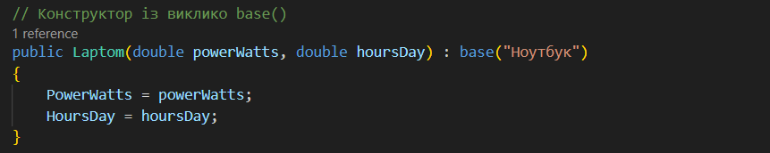

# Лабораторна робота 3 (варіант 5)

## Завдання

- Реалізувати базовий клас та мінімум.
- Використання конструктора з `base(...)`.
- Продемострувати поліморфізм.

## Виконання

у програмі реалізовано абстрактний клас `Device` та похідні `Laptom`, `Fridge`.

- Конструктор із викликом `base(...)`;

  

- Перевизначення методу `virtual/override`;

  

- Колекція з об'єктами різних типів (`List<Device>`);

  

## Результати

Програма виводить споживання енергії девайсу, та сумарне мпоживання енергії.

