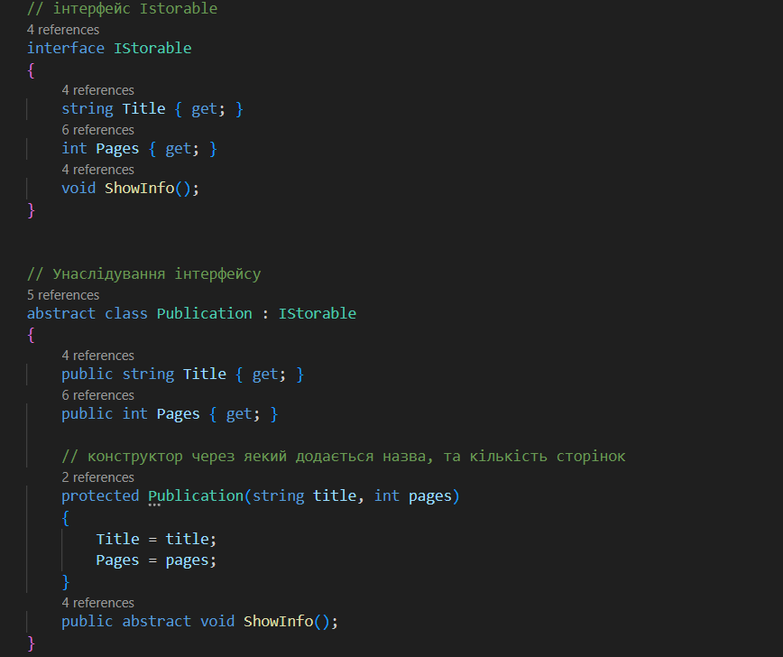
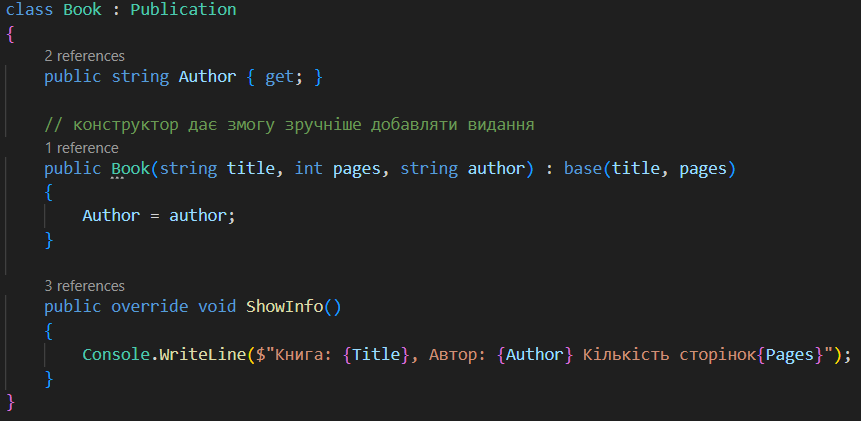
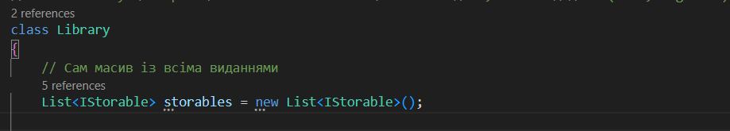
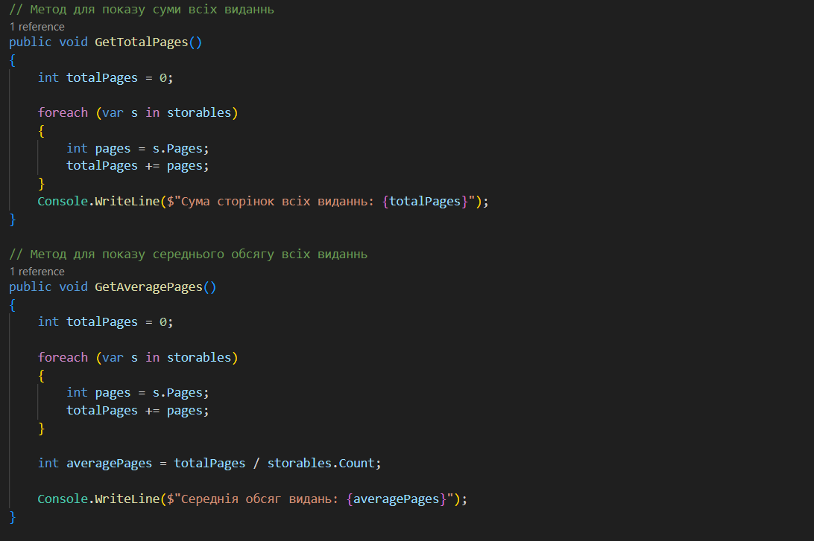
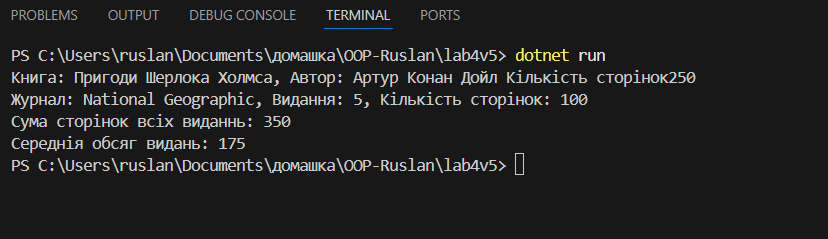

# Лабораторна робота №4

## Завдання

- Реалізувати базовий інтерфейс та абстрактний клас.
- Забеспечити мінімум дві різні реалізації.
- Використати композиція чи агрегацію для зв'язків між класами.

## Виконання

У програмі реалізований інтерфейс `IStorable`, абстракний клас `Publication` та реалізації `Book`, `Magazine`.

- Абстрактний клас `Publication` реалізовує інтерфейс `IStorable`.

- Клас `Book` та `Magazine` наслідує `Publication`.

- Клас `Library` це агрегація, так як він містить колекція всіх видань (`Book`, `Magazine`).

- Також в `Library` є методи для показу всіх кількості сторінок у бібліотеці, та середнього обсягу видань.

## Результати

Програма виводить всіх сторінок у бібліотеці, та середній обсяг видань.

