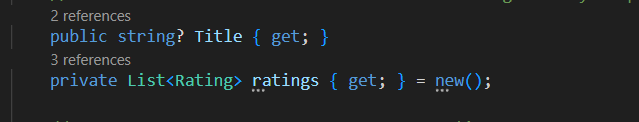
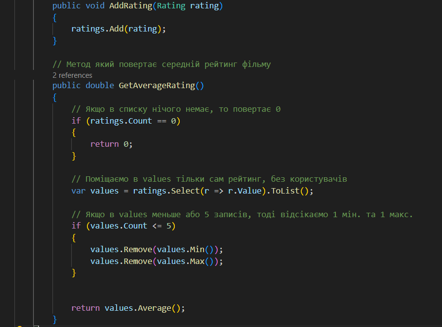
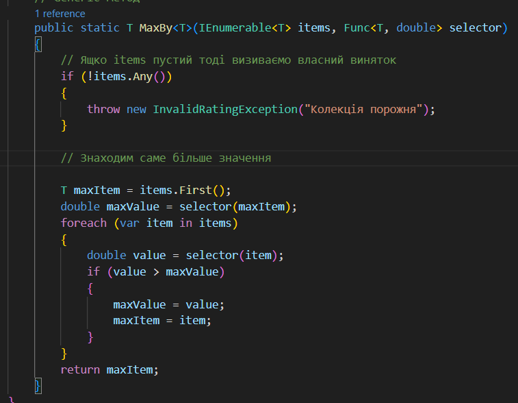
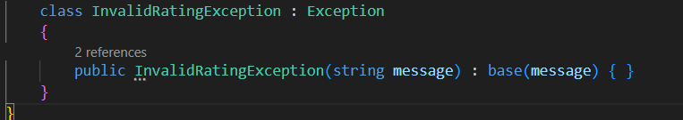
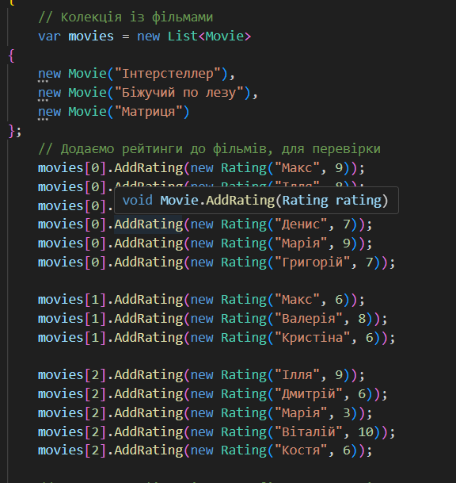
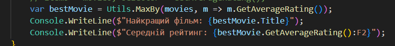
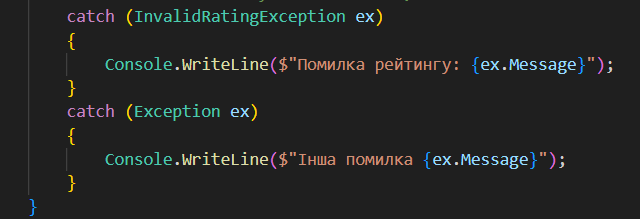
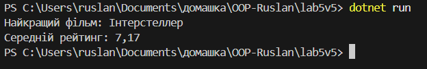

# Лабораторна робота №5

## Завдання

- Один узагальнений компонент `Repository<T>, Result<T>, Response<T>`, або метод `T Max<T>(...)`.
- Контроль вхідних даних + власні винятки
- Обчислення/операції з колекціями (сума/середнє/мін/макс, відсотки, прості перетворення).
- Агрегація: Movie приймає рейтинги від користувачів.
- Обчислення: середній рейтинг (із відсіканням 1 мін. та 1 макс., якщо записів ≥5).
- Generics: метод T MaxBy<T>(IEnumerable<T>, Func<T,double>).

## Виконання

У програмі є клас `Movie` та клас `Rating`, зв'язок між ними агрегаційний. Є клас `Utils` в якому реалізовано Generic метод `T MaxBy<T>`, і є клас `InvalidRatingException` власний виняток.

- Агррегація `Movie` приймає рейтинг від класу `Rating`.

  

- В `Rating` ми вказуємо рейтинг та ім'я користувача, який його поставив.

  

- В класі `Movie` є методи `AddRating()` для додавання об'єкту класа `Rating` в список `List<Rating>`, та `GetAverageRating()` який повертає середній рейтинг фільму.

  

- Метод `T MaxBy<T>` приймає `IEnumerable<T>` та `Func<T, double>`, і повертає індекс самого більшого числа.

  

- Клас `InvalidRatingException` де ми через конструктори передаємо повідомлення `message`, і воно передається далі у базовий конструкор.

  

- В `Program.cs` створенна колекція `List<Movie>` де ми створюємо об'єкти класу `Movie`, також для кожного фільму ит додаємо рейтинги, тобто через метод `AddRating()` додаємо нові об'єкти класу `Rating`.

  

- Визиваємо метод `MaxBy()` для того що б вивести фільм із кращим рейтингом. Як аргументи записуємо колекцію `movies`, де зберігаються фільми. Як функцію записуємо `GetAverageRating()`, який повертає середню оцінку фільму.

  

- В кінці додаємо `catch`, `InvalidRatingException` власний виняток, якщо якась із наших умов буде нарушена, тоді він поверне `ex.Message` в якому буде повідомлення яке ми записали в `throw new InvalidRatingException`

  

## Результати

- Результат при правильному використанні, без виходу за межі:

  

- Ось для прикладу що буде якщо ми вийдемо за межі, тобто поставимо оцінку 11:

  

## Контрольні питання

- Generic - це узагальнений метод, який дозволяє працювати із різними типами, без дублювання коду. наприклад `List<T>` може бути `List<int>` або `List<string>`.

- В `ArrayList` можна додати різні типи такі як `int` і `string` в один список. А `List<T>` зберігає тільки елементи певного типу.

- `Dictionary<TKey,TValue>` зберігає елементи за ключом. `List<T>` це просто список елементів.

- Перевага `LINQ` в облегчені написання коду, та розуміння. Банально більш читабельний код.

- `finally` виконується завжди, незалежно від того чи виникла помилка чи ні.

- Власні класи винятків доцільно створювати, коли потрібно чітко описати специфічну помилку, яку не покривають стандартні винятки.
