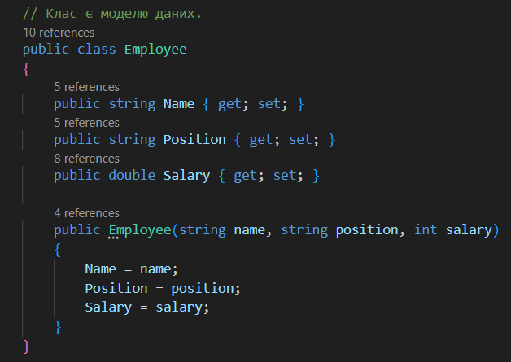
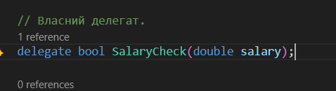
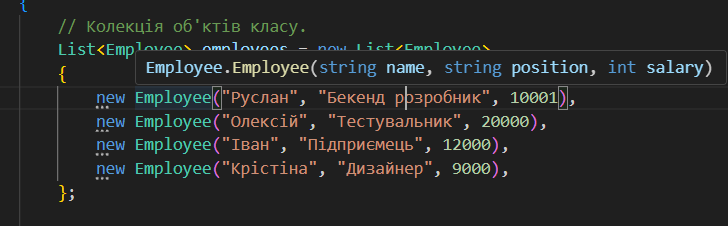
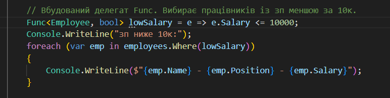
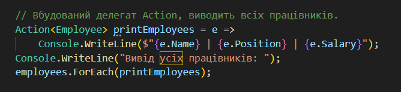
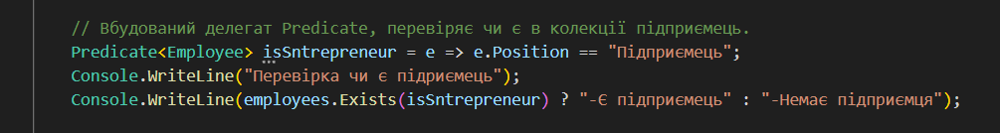
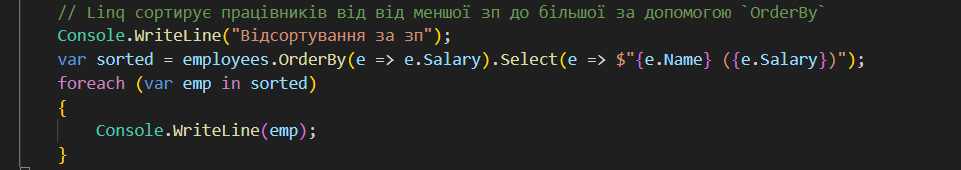
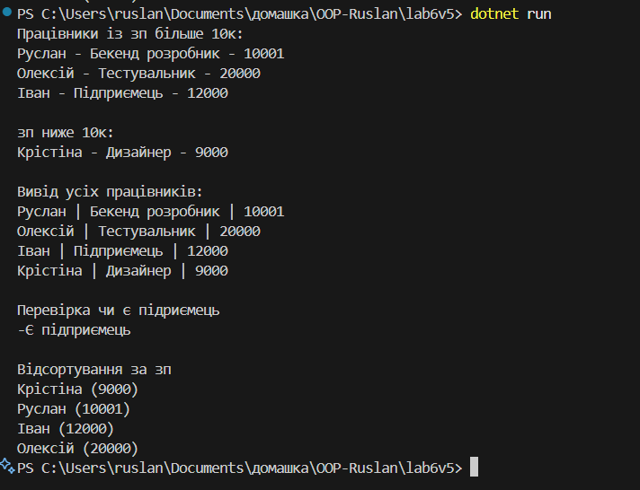

# Лабораторна робота №6

## Завдання

- Клас Employee (ім’я, посада, зарплата).
- Застосувати Func<Employee, bool> для вибору працівників із зарплатою >10 000.
- Action<Employee> — для виводу списку в консоль.

## Виконання та реалізація

Програма складається із класу `Employee`, власних делегатів, анонімних делегатів, та Linq методів.

- Було створенно клас `Employee`, в якому зберігаються працівники, він є моделю даних для програми:

- Створено власний делегат `SalaryCheck`, для подальшого облегчення написання коду:

- В статичному Main є колекція об'єктів класу `Employee`:

- Оголошено анонімний делегат, який зберігає працівників із зп більше ніж 10к.:

- За допомогою вбудованого делегату `Func` було виведено прицівників в яких зп менш ніж 10к:

- Вбудований делегат `Action` виводить всіх працівників не залежно від зп:

- Також є ще один вбудований делегат `Predicate`, за допомогою якого перевіряється чи є в списку об'єкт із посадою "Підприємець":

- Є методи `Linq` `Where` та `Select` за допомогою яких сортируються сортуються працівникі по зарплаті за зростанням:

## Результат

Результати видно на скріншоті:

