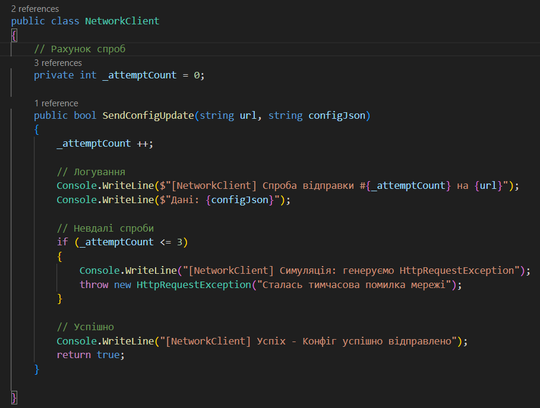
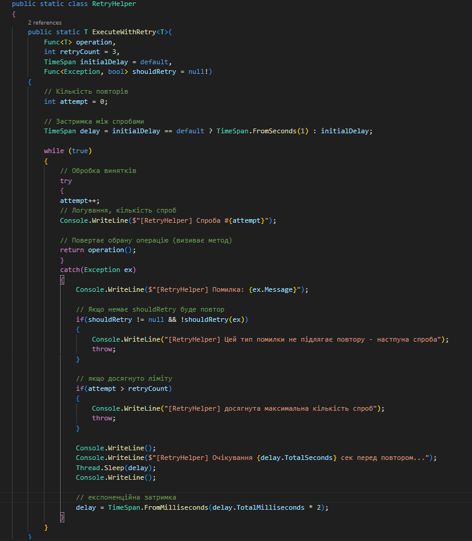
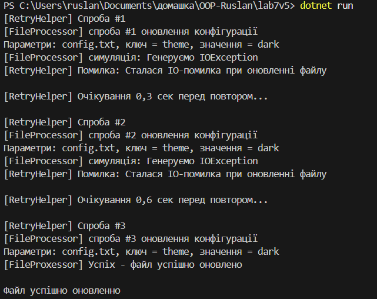
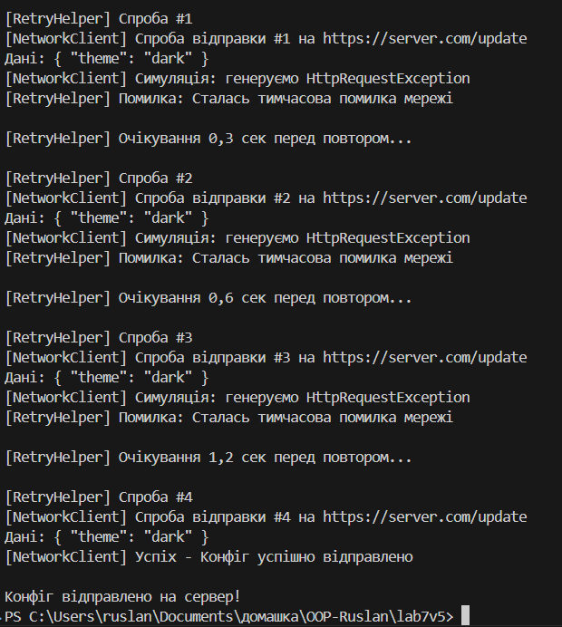

# Лабораторна робота №7

## Завдання

Сценарій: Оновлення конфігурації.

- FileProcessor: Метод `void UpdateConfig(string path, string key, string value)`. Імітувати `IOException` перші 2 рази, потім успіх.
- NetworkClient: Метод `bool SendConfigUpdate(string url, string configJson)`. Імітувати `HttpRequestException` перші 3 рази, потім успіх.
- shouldRetry: Повторювати для `IOException` та `HttpRequestException`.

## Виконання та реалізація

В програмі було реалізовано 3 основні класи: `FileProcssor`, `NetworkClient` та `shouldRetry`. Також є клас який збирає все `Program`. Також в трьох основних класах було зроблено логування.

- Клас `FileProcssor` імітує спроби оновлення файлу.

- Клас `NetworkClient` імітує спроби відправлення конфігу.

- Узагальнений клас `shouldRetry` за допомогою якого дуже зручно повторювати імітації помилок. Також є затримка між повторюванням.

- Клас `Program` створює об'єкти перших двох класів, та використовує їх для повторення в `shouldRetry`.

## Результати

Скріншоти із виконанням програми в консолі:

- Спроба виклику `shouldRetry` для `FileProcssor`:

- Друга спроба для `NetworkClient`:

## Контрольні питання

1. Які типи винятків найчастіше виникають при роботі з файлами та мережею?

   - Самі популярні помилки при роботі із файлами: `FileNotFoundException` – файл не знайдено за вказаним шляхо, `IOException` – загальна помилка вводу/виводу, наприклад, файл заблоковано іншою програмою, `UnauthorizedAccessException` – відсутні права доступу до файлу.

   - Самі популярні при роботі із мережою: `HttpRequestException` – помилка при виконанні HTTP-запиту, `TimeoutException` – перевищено час очікування відповіді, `WebException` – проблеми з HTTP-з’єднанням (404, 500, проблеми DNS).

2. Поясніть принцип роботи патерну Retry. Коли його доцільно використовувати?

   - Цей патерн використовується коли операція тимчасово не працює, через зовнішні фактори. Патерн виконується коли: потрібно повторно спробувати виконати операцію, почекати певний час і спробувати ще раз, Повторювати до успіху або поки не досягнемо максимальної кількості спроб.

3. Для чого потрібен делегат shouldRetry у допоміжному класі RetryHelper?

   - Призначення: Це функція типу `Func<Exception, bool>`, яка приймає виняток `ex` і повертає true або false. Вона визначає, чи можна повторювати операцію після конкретного винятку. Якщо shouldRetry(ex) повертає false, повтор не виконується, і виняток пробрасывается далі. Якщо shouldRetry = null, то повтори йдуть для будь-якої помилки.
